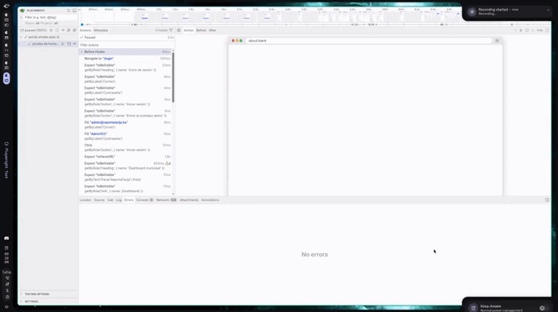

<div align="center">

# 🏛️ Panel ReportaTarija

**Portal web municipal para la gestión y seguimiento de reportes ciudadanos en Tarija.**


---

**Materia:** Ingeniería de Software 2 &nbsp;·&nbsp; **Tema:** Soluciones para el sector público y social  
**Autor:** Jiménez Daniel Gustavo

</div>

---

## 📋 Descripción

ReportaTarija es una plataforma municipal que permite a los **funcionarios de la alcaldía** gestionar y hacer seguimiento de reportes ciudadanos sobre problemas urbanos: baches, alumbrado público, basura acumulada, fugas de agua, entre otros.

> ⚠️ Este repositorio corresponde al **portal web municipal**. La app móvil ciudadana pertenece a un repositorio separado.

El portal está orientado exclusivamente al **personal municipal**, no al ciudadano final.


---

## ✨ Funcionalidades principales

| Módulo | Descripción |
|---|---|
| 🔐 **Autenticación** | Inicio de sesión de funcionarios municipales |
| 📊 **Dashboard** | Métricas generales y resumen operativo de reportes |
| 📋 **Gestión de reportes** | Filtrado por estado, categoría y prioridad |
| 🗺️ **Mapa y Kanban** | Vista geoespacial y tablero de seguimiento operativo |
| 🔍 **Detalle de reporte** | Ubicación, evidencias e historial completo |
| ✏️ **Acciones** | Cambio de estado y asignación de responsable o área |
| 👥 **Accesos** | Gestión básica de permisos administrativos |
| 🔔 **Notificaciones** | Sistema de notificaciones internas del portal |
| 🤖 **Asistente IA** | Análisis para apoyar la revisión municipal de reportes |

---

## 🔄 Flujo principal

```
1. Inicio de sesión          →  Funcionario accede al portal
2. Revisión del dashboard    →  Identifica el estado general de los reportes
3. Gestión de reportes       →  Filtra, busca y revisa reportes pendientes
4. Detalle del reporte       →  Consulta descripción, ubicación, evidencias e historial
5. Acción municipal          →  Cambia el estado o asigna responsable/área
6. Seguimiento               →  El sistema notifica y registra el avance internamente
```

<p align="center">
  
  
</p>

---

## 🛠️ Stack tecnológico

### Frontend

| Tecnología | Uso |
|---|---|
| React + Vite + TypeScript | Base del proyecto |
| Tailwind CSS + Radix UI + shadcn | Estilos y componentes UI |
| React Router | Navegación y rutas |
| TanStack Query | Estado del servidor y caché |
| React Hook Form + Zod | Formularios y validación |
| Recharts | Gráficos y métricas |
| MapLibre GL | Visualización de mapas |

### Backend / Infraestructura

| Tecnología | Uso |
|---|---|
| InsForge (BaaS) | Autenticación, base de datos, storage y funciones |
| Vitest | Pruebas unitarias |
| Playwright | Pruebas end-to-end |
| pnpm | Gestión de paquetes |

---

## 🏗️ Arquitectura

El proyecto utiliza una **arquitectura modular basada en features**. Cada módulo encapsula sus propios componentes, hooks, servicios, DTOs, validaciones, tipos y pruebas.

```
src/
├── app/                  # Configuración general, rutas y providers
├── features/
│   ├── auth/             # Login, sesión y protección de rutas
│   ├── dashboard/        # Métricas y resumen operativo
│   ├── reports/          # Gestión, detalle, filtros, mapa, acciones y tracking
│   ├── staff/            # Gestión de funcionarios y accesos
│   └── notifications/    # Notificaciones internas
├── shared/               # Componentes, layout y utilidades reutilizables
└── lib/                  # Clientes compartidos (InsForge, TanStack Query)
```

Esta organización favorece la **independencia entre módulos**, la separación de responsabilidades y facilita las pruebas.

---

## 🧩 Patrones de diseño aplicados

| Patrón | Implementación |
|---|---|
| **Repository** | Servicios por feature encapsulan el acceso a InsForge |
| **Facade** | Hooks personalizados simplifican el uso de servicios, queries y mutations |
| **Singleton** | Cliente InsForge y QueryClient centralizados |
| **DTO** | Objetos de transferencia para login, acciones, funcionarios y notificaciones |
| **Adapter** | Servicio de análisis IA adapta llamadas externas a una interfaz del dominio |
| **Observer** | TanStack Query actualiza vistas ante cambios en reportes y notificaciones |

> 📄 Más detalle en [`docs/patrones_diseño.md`](docs/patrones_diseño.md)

---

## 🧹 Calidad y refactorización

Antes de la fase de pruebas se corrigieron *bad smells* y se refactorizaron los módulos principales:

- Separación de lógica de negocio fuera de los componentes visuales
- Extracción de hooks para reducir responsabilidades en páginas
- Validaciones con Zod para eliminar validación primitiva dispersa
- Uso de constantes para evitar *magic numbers* y strings repetidos
- Componentes reutilizables para estados, badges, tablas, filtros y formularios

> 📄 Más detalle en [`docs/Refactor_Badsmells_fix.md`](docs/Refactor_Badsmells_fix.md)

---

## 🧪 Pruebas y TDD

Se aplicó **TDD** como metodología de desarrollo incremental siguiendo el ciclo **Red → Green → Refactor**:

1. Se define el comportamiento esperado mediante pruebas automatizadas
2. Se implementa el código mínimo para pasar la prueba
3. Se refactoriza manteniendo el comportamiento validado

### Pruebas implementadas

- ✅ Validación de login con credenciales válidas e inválidas
- ✅ Rechazo de reportes con comentario obligatorio
- ✅ Asignación de responsable o área municipal
- ✅ Cálculo de métricas del dashboard por estado
- ✅ Regla de reporte vencido después de 15 días sin atención
- ✅ Prueba de humo del flujo principal con Playwright

### Archivos de pruebas

```
src/features/auth/tests/loginDto.test.ts
src/features/reports/tests/reportActionDtos.test.ts
src/features/reports/tests/reportBusinessRules.test.ts
tests/smoke/portal.smoke.spec.ts
```


> 📄 Documentación: [`docs/tests_tdd.md`](docs/tests_tdd.md) · [`docs/prueba_humo.md`](docs/prueba_humo.md)

---

## 💨 Prueba de humo

Verifica rápidamente que el sistema arranca, permite iniciar sesión y que las pantallas principales responden correctamente.

**Pantallas cubiertas:** Login · Dashboard · Reportes · Accesos administrativos · Notificaciones

```bash
# Ejecutar en modo headless
pnpm test:smoke

# Ejecutar con navegador visible
pnpm exec playwright test tests/smoke --headed
```


---

## ⚙️ Configuración del entorno

La conexión con InsForge está centralizada en `src/lib/insforge.ts`.

Crea un archivo `.env` en la raíz del proyecto con las siguientes variables:

```env
VITE_INSFORGE_URL=https://uri.insforge.com
VITE_INSFORGE_ANON_KEY=tu_anon_key
VITE_SMOKE_ADMIN_EMAIL=admin@reportatarija.bo
VITE_SMOKE_ADMIN_PASSWORD=tu_password
```

El esquema y los datos de demostración están versionados en:

```
database/insforge-schema-seed.sql
```

---

## 🚀 Comandos

```bash
# Instalar dependencias
pnpm install

# Servidor de desarrollo
pnpm dev

# Build de producción
pnpm build

# Linter
pnpm lint

# Ejecutar pruebas unitarias
pnpm test

# Ejecutar prueba de humo
pnpm test:smoke
```

---

<div align="center">

Desarrollado con ❤️ para la Alcaldía de Tarija &nbsp;·&nbsp; Ingeniería de Software 2

</div>