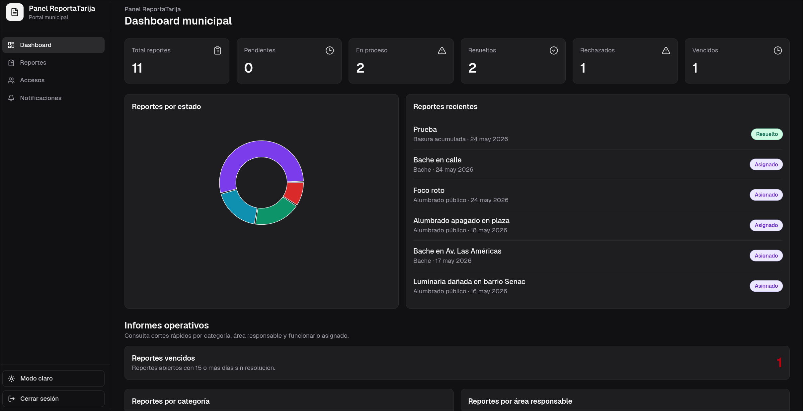
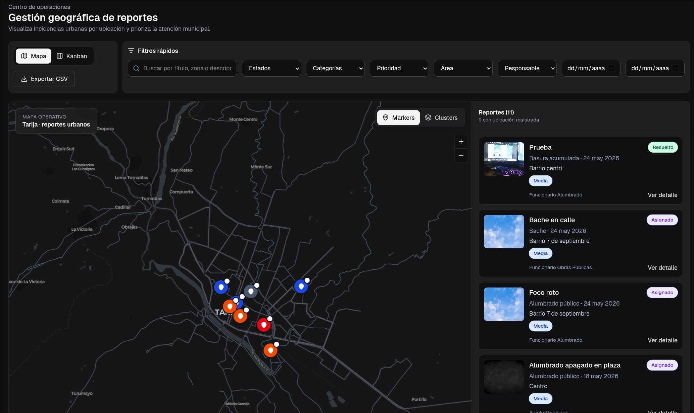
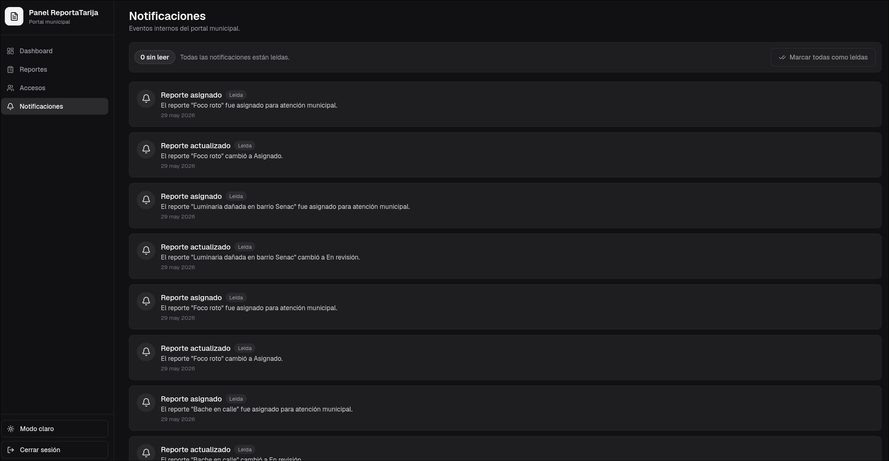
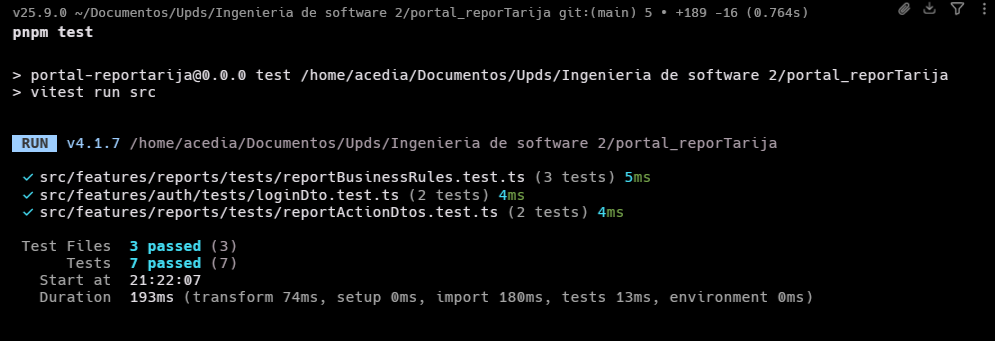

# Panel ReportaTarija

Portal web municipal para la gestion y seguimiento de reportes ciudadanos en Tarija.

## Datos del proyecto

- **Materia:** Ingenieria de Software 2
- **Tema:** Soluciones para el sector publico y social
- **Proyecto:** App de reporte ciudadano - Jimenez Daniel Gustavo
- **Descripcion general:** Plataforma para reportar problemas urbanos como baches, alumbrado publico, basura acumulada o fugas de agua, con seguimiento desde el municipio.
- **Repositorio actual:** Portal web municipal. La app movil ciudadana pertenece a otro repositorio.

## Objetivo del sistema

ReportaTarija permite que funcionarios de la alcaldia o municipalidad revisen reportes ciudadanos, consulten su ubicacion, gestionen evidencias, asignen responsables, cambien estados y hagan seguimiento interno hasta su resolucion.

El portal esta orientado al personal municipal, no al ciudadano final.

```md

```

## Funcionalidades principales

- Inicio de sesion de funcionarios.
- Dashboard con metricas generales de reportes.
- Gestion de reportes ciudadanos por estado, categoria y prioridad.
- Vista de mapa y tablero tipo kanban para seguimiento operativo.
- Detalle de reporte con ubicacion, evidencias e historial.
- Cambio de estado y asignacion de responsable o area municipal.
- Gestion basica de accesos administrativos.
- Notificaciones internas del portal.
- Asistente de analisis para apoyar la revision municipal de reportes.

```md


```

### Flujo principal del portal

El flujo esperado de uso es:

1. El funcionario inicia sesion en el portal.
2. Revisa el dashboard para identificar el estado general de los reportes.
3. Entra a la gestion de reportes para filtrar, buscar o revisar reportes pendientes.
4. Abre el detalle de un reporte para ver descripcion, ubicacion, evidencias e historial.
5. Cambia el estado del reporte o asigna un responsable/area municipal.
6. El sistema mantiene el seguimiento mediante tracking y notificaciones internas.

## Stack de desarrollo

- **Frontend:** React, Vite, TypeScript.
- **Estilos:** Tailwind CSS, Radix UI, shadcn, Lucide React.
- **Rutas:** React Router.
- **Estado servidor/cache:** TanStack Query.
- **Formularios y validacion:** React Hook Form y Zod.
- **Graficos:** Recharts.
- **Mapas:** MapLibre GL.
- **Backend/BaaS:** InsForge para autenticacion, base de datos, storage y funciones.
- **Testing:** Vitest y Playwright.
- **Gestor de paquetes:** pnpm.

## Arquitectura

El proyecto usa una arquitectura modular basada en **features**. Cada modulo agrupa sus propios componentes, hooks, servicios, DTOs, validaciones, tipos y pruebas cuando corresponde.

```txt
src/
  app/                 Configuracion general, rutas y providers
  features/
    auth/              Login, sesion y proteccion de rutas
    dashboard/         Metricas y resumen operativo
    reports/           Gestion, detalle, filtros, mapa, acciones y tracking
    staff/             Gestion de funcionarios/accesos
    notifications/     Notificaciones internas
  shared/              Componentes, layout y utilidades reutilizables
  lib/                 Clientes compartidos como InsForge y TanStack Query
```

Esta organizacion ayuda a mantener independencia entre modulos, separacion de responsabilidades y componentes mas faciles de probar y mantener.

## Patrones aplicados

- **Repository:** servicios por feature encapsulan el acceso a InsForge.
- **Facade:** hooks personalizados simplifican el uso de servicios, queries, mutations y formularios.
- **Singleton:** cliente de InsForge y QueryClient centralizados.
- **DTO:** objetos de transferencia para login, acciones de reportes, funcionarios y notificaciones.
- **Adapter:** servicio de analisis IA adapta llamadas externas a una interfaz propia del dominio.
- **Observer:** TanStack Query actualiza vistas cuando cambian reportes, notificaciones o datos relacionados.

Mas detalle en `docs/patrones_diseño.md`.

## Calidad y refactorizacion

Antes de la fase de pruebas se corrigieron bad smells y se refactorizaron modulos principales:

- Separacion de logica de negocio fuera de componentes visuales.
- Extraccion de hooks para reducir responsabilidades en paginas.
- Validaciones con Zod para evitar validacion primitiva dispersa.
- Constantes para evitar magic numbers y strings repetidos.
- Componentes reutilizables para estados, badges, tablas, filtros y formularios.

Mas detalle en `docs/Refactor_Badsmells_fix.md`.

## Pruebas y TDD

Se aplico TDD como metodologia de desarrollo incremental usando el ciclo **Red, Green, Refactor**:

1. Se definio primero el comportamiento esperado mediante pruebas automatizadas.
2. Se implemento el codigo minimo para pasar la prueba.
3. Se refactorizo manteniendo el comportamiento validado.

Pruebas automatizadas implementadas:

- Validacion de login con credenciales validas e invalidas.
- Validacion de reglas para rechazar reportes con comentario obligatorio.
- Validacion de asignacion con responsable o area municipal.
- Calculo de metricas del dashboard por estado.
- Regla de reporte vencido despues de 15 dias sin atencion.
- Prueba de humo del flujo principal del portal con Playwright.

Archivos principales:

```txt
src/features/auth/tests/loginDto.test.ts
src/features/reports/tests/reportActionDtos.test.ts
src/features/reports/tests/reportBusinessRules.test.ts
tests/smoke/portal.smoke.spec.ts
```

Documentacion relacionada:

```txt
docs/tests_tdd.md
docs/prueba_humo.md
```

```md

```

## Prueba de humo

La prueba de humo es una prueba por objetivo. Verifica rapidamente que el sistema arranca, permite iniciar sesion y que las pantallas principales responden:

- Login.
- Dashboard.
- Reportes.
- Accesos administrativos.
- Notificaciones.

Comando:

```bash
pnpm test:smoke
```

Para verla navegando en el navegador:

```bash
pnpm exec playwright test tests/smoke --headed
```

```md

```

## Comandos principales

```bash
pnpm install
pnpm dev
pnpm build
pnpm lint
pnpm test
pnpm test:smoke
```

## Configuracion de entorno

La conexion con InsForge esta centralizada en:

```txt
src/lib/insforge.ts
```

Variables esperadas:

```env
VITE_INSFORGE_URL=https://uri.insforge.com
VITE_INSFORGE_ANON_KEY=tu_anon_key
VITE_SMOKE_ADMIN_EMAIL=admin@reportatarija.bo
VITE_SMOKE_ADMIN_PASSWORD=tu_password
```

El esquema y datos demo estan versionados en:

```txt
database/insforge-schema-seed.sql
```

